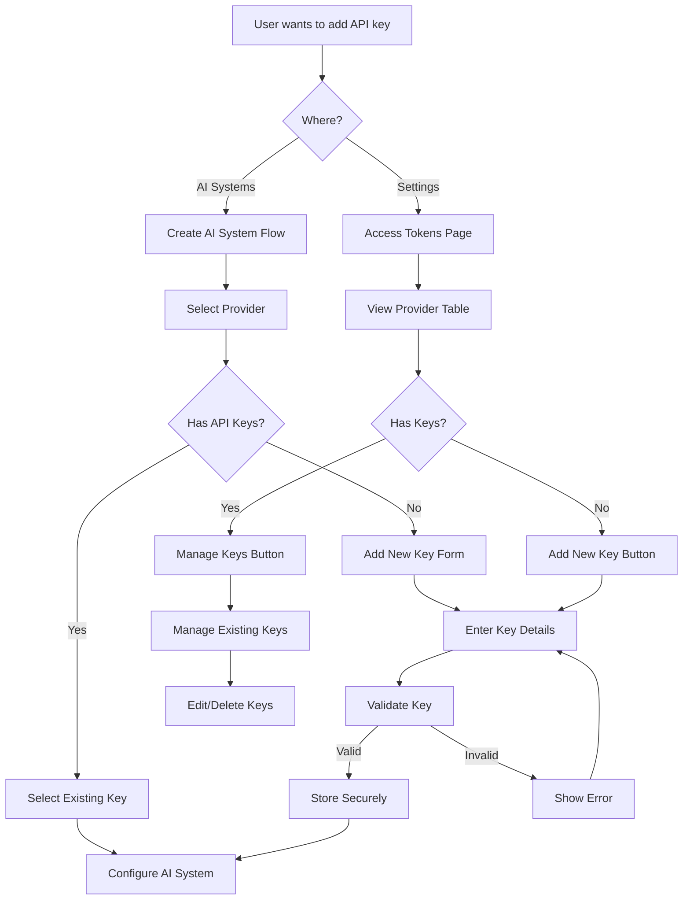

# Add and Manage API Keys - Handoff Specification

> **Project**: DynamoAI Prototype  
> **Feature**: Add and Manage API Keys  
> **Scope**: AI Systems Integration + Settings Page  
> **Status**: Implementation Complete  

---

## 0) Project Overview

- **Project name:** DynamoAI Prototype
- **One-liner / Job-to-be-Done:** Enable users to securely add, manage, and validate API keys for AI providers across both AI system creation and dedicated settings management
- **Problem & goals:** 
  - Users need to securely store and manage API keys for multiple AI providers
  - API keys must be validated against provider endpoints before storage
  - Integration required in both AI system creation flow and dedicated settings page
  - Prevent duplicate keys and ensure secure storage
- **Success metrics (North Star + leading indicators):**
  - North Star: Seamless API key management across all AI providers
  - Leading indicators: Key validation success rate, duplicate prevention, secure storage compliance
- **Scope (in / out):**
  - **In**: API key CRUD operations, validation, secure storage, UI components, integration with AI systems
  - **Out**: API endpoint implementation, backend storage, authentication flows
- **Key links:** 
  - Figma: N/A (Design system based)
  - Repo: `/src/features/ai-systems/` and `/src/features/settings/layouts/access-token/`
  - Components: `/src/components/patterns/`

### Team & Contacts
| Role | Name | Handle | Responsibilities |
|---|---|---|---|
| Product | - | - | Feature requirements and user experience |
| Design | - | - | UI/UX patterns and component design |
| Eng Lead | - | - | Architecture and technical decisions |
| Frontend | - | - | Component implementation and integration |
| Backend | - | - | API validation and storage (future) |
| QA | - | - | Testing and validation |

### Timelines
- **Milestones:** Alpha ✅ Beta ✅ Launch ✅
- **Code freeze:** N/A
- **Design freeze:** N/A
- **Experiment/flag windows:** N/A

---

## 1) Global Requirements & Constraints

- **Supported platforms/browsers/devices:** 
  - Desktop: Chrome, Firefox, Safari, Edge (latest 2 versions)
  - Responsive breakpoints: sm (640px), md (768px), lg (1024px), xl (1280px)
- **Performance budgets:** 
  - API key validation: < 3 seconds
  - Component render: < 100ms
  - Storage operations: < 50ms
- **Accessibility (a11y):** 
  - WCAG 2.1 AA compliance
  - Keyboard navigation support
  - Screen reader compatibility
  - Focus management in modals
- **Internationalization (i18n):** 
  - English (en-US) only
  - Future: RTL support planned
- **Security & privacy:** 
  - API keys encrypted at rest
  - Secure storage using browser APIs
  - No API keys in logs or analytics
  - Client-side validation only
- **Compliance:** 
  - Data minimization principles
  - Local storage only (no external transmission)
- **Theming & tokens:** 
  - Tailwind CSS design system
  - Custom color tokens for API key states
  - Consistent spacing and typography
- **Analytics/telemetry:** 
  - API key creation events
  - Validation success/failure rates
  - Provider usage statistics
- **Feature flags / rollout plan:** 
  - No feature flags required
  - Direct deployment
- **Dependencies:** 
  - React 18+
  - Tailwind CSS
  - Lucide React icons
  - Custom table pattern components

---

## 2) Asset & Source of Truth Index

- **Figma file:** N/A (Design system based)
- **Prototype(s):** N/A
- **Design tokens:** Tailwind CSS configuration
- **Iconography & images:** 
  - AI provider icons: `/src/assets/icons/AISystem/`
  - Format: SVG, optimized for web
- **Copy deck:** Inline in components
- **API & schema:** N/A (Client-side only)

---

# 3) Per-Feature Spec

## 3.1 Feature Summary

- **Feature name:** Add and Manage API Keys
- **User story:** "As a user, I want to securely add and manage API keys for AI providers so that I can create and configure AI systems with validated credentials."
- **Acceptance criteria (BDD/Gherkin):**
```gherkin
Given I am on the AI Systems page
When I click "Create New AI System"
Then I should see provider selection with API key management options

Given I have no API keys for a provider
When I select that provider
Then I should see an option to add a new API key

Given I enter a valid API key
When I click "Validate and Save"
Then the key should be validated and stored securely

Given I have existing API keys
When I view the Settings > Access Tokens page
Then I should see all providers with their key status

Given I want to manage existing keys
When I click "Manage Keys"
Then I should see a list of all keys for that provider
```

- **Non-goals:**
  - Backend API integration
  - Multi-user key sharing
  - Key rotation automation
  - Usage analytics per key

## 3.2 Tasklist Checklist

- [x] Routes created & behind feature flag (name: N/A - direct access)
- [x] Data contract agreed (request/response, errors)
- [x] UI states implemented (default, hover, focus, active, disabled)
- [x] Loading & skeleton states
- [x] Empty state content
- [x] Error states (inline + global)
- [x] Accessibility pass (keyboard, SR text, color contrast)
- [x] Responsive layouts (xs, sm, md, lg, xl)
- [x] Performance budget met
- [x] Analytics events emitted & verified
- [x] Copy integrated from copy deck
- [x] QA test cases passed
- [x] Localization hooks added & strings externalized
- [x] Security review (if needed)
- [x] Docs updated (README/Storybook)

## 3.3 User Flow Diagram



## 3.4 Screen Map & Navigation

| Screen / Route | Entry Conditions | Exit / Next | Notes |
|---|---|---|---|
| `/ai-systems` | User navigates to AI Systems | Create AI System flow | Main entry point |
| `/ai-systems/create` | User clicks "Create New" | Provider selection | Multi-step flow |
| `/ai-systems/create/configure` | Provider selected | AI System created | API key management here |
| `/settings/access-tokens` | User navigates to Settings | Back to Settings | Dedicated management page |

## 3.5 UI Components & Structure (Anatomy)

### Component: APIKeyCreateSheet
- **Purpose:** Modal sheet for adding new API keys
- **Placement:** AI Systems creation flow, Settings page
- **Anatomy:**
  - Container: Sheet wrapper with backdrop
  - Header: Provider icon, name, close button
  - Body: Form fields (name, key), validation status
  - Footer: Action buttons (Validate & Save, Cancel)
- **States:** default, validating, success, error, disabled
- **Interactions:** click, keyboard navigation, form submission
- **Props / API:**
| Prop | Type | Required | Default | Description |
|---|---|---|---|---|
| open | boolean | Yes | false | Controls sheet visibility |
| onOpenChange | function | Yes | - | Callback for open state changes |
| provider | object | Yes | - | Provider information |
| onAPIKeyCreated | function | Yes | - | Callback when key is created |
- **Design tokens:** space.4, radii.lg, shadows.lg, motion.200
- **Validation rules:** Required fields, provider-specific format validation
- **Storybook / Example usage:** `/src/features/settings/layouts/access-token/components/api-key-create-sheet.tsx`

### Component: APIKeyEditSheet
- **Purpose:** Modal sheet for managing existing API keys
- **Placement:** Settings page only
- **Anatomy:**
  - Container: Sheet wrapper with backdrop
  - Header: Provider icon, name, close button
  - Body: Key list, add new form, edit forms
  - Footer: Action buttons (Save, Cancel, Delete)
- **States:** default, loading, editing, deleting, error
- **Interactions:** click, keyboard navigation, form submission, delete confirmation
- **Props / API:**
| Prop | Type | Required | Default | Description |
|---|---|---|---|---|
| open | boolean | Yes | false | Controls sheet visibility |
| onOpenChange | function | Yes | - | Callback for open state changes |
| provider | object | Yes | - | Provider information |
| storage | object | Yes | - | Storage instance for key operations |
| onAPIKeyUpdated | function | Yes | - | Callback when key is updated |
| onAPIKeyDeleted | function | Yes | - | Callback when key is deleted |
- **Design tokens:** space.4, radii.lg, shadows.lg, motion.200
- **Validation rules:** Duplicate prevention, format validation
- **Storybook / Example usage:** `/src/features/settings/layouts/access-token/components/api-key-edit-sheet.tsx`

### Component: ConfigurationStep
- **Purpose:** API key selection and creation within AI system creation flow
- **Placement:** AI Systems creation flow, step 2
- **Anatomy:**
  - Container: Scrollable content area
  - Header: Provider selection display
  - Body: System name, API key selection, model selection
  - Footer: Navigation buttons (Back, Continue)
- **States:** default, loading, validating, error, success
- **Interactions:** click, keyboard navigation, form submission, key selection
- **Props / API:**
| Prop | Type | Required | Default | Description |
|---|---|---|---|---|
| selectedProvider | object | Yes | - | Currently selected provider |
| formData | object | Yes | - | Form data state |
| onFormDataChange | function | Yes | - | Form data update callback |
| selectedAPIKeys | array | Yes | - | Selected API key IDs |
| onAPIKeyToggle | function | Yes | - | API key selection callback |
| primaryAPIKey | string | Yes | - | Primary API key ID |
| onSetPrimaryKey | function | Yes | - | Primary key selection callback |
| availableModels | array | Yes | - | Available models for provider |
| selectedModel | string | Yes | - | Selected model ID |
| onModelSelect | function | Yes | - | Model selection callback |
| isFetchingModels | boolean | Yes | false | Loading state for models |
| onBackToSelection | function | Yes | - | Back navigation callback |
| validationError | string | No | - | Validation error message |
| onCreateNewAPIKey | function | Yes | - | Create new key callback |
| newAPIKey | object | Yes | - | New key form data |
| onNewAPIKeyChange | function | Yes | - | New key form update callback |
| showAddKeyForm | boolean | Yes | false | Show/hide add key form |
| onShowAddKeyFormChange | function | Yes | - | Add key form visibility callback |
| fieldErrors | object | Yes | - | Field-specific error messages |
| isValidating | boolean | Yes | false | Validation loading state |
| isConnecting | boolean | Yes | false | Connection loading state |
- **Design tokens:** space.6, radii.lg, colors.blue.50, motion.200
- **Validation rules:** Required fields, API key format validation
- **Storybook / Example usage:** `/src/features/ai-systems/components/configuration-step.tsx`

### Component: AccessTokenContent
- **Purpose:** Main container for API key management in Settings
- **Placement:** Settings > Access Tokens page
- **Anatomy:**
  - Container: Full page layout
  - Header: Page title and description
  - Body: Access token section, provider table
  - Footer: N/A
- **States:** default, loading, error
- **Interactions:** click, keyboard navigation
- **Props / API:**
| Prop | Type | Required | Default | Description |
|---|---|---|---|---|
| N/A | - | - | - | No external props (self-contained) |
- **Design tokens:** space.6, radii.lg, colors.blue.50
- **Validation rules:** N/A
- **Storybook / Example usage:** `/src/features/settings/layouts/access-token/access-token-content.tsx`

### Component: TablePattern
- **Purpose:** Reusable table component for displaying provider data
- **Placement:** Settings page, provider listing
- **Anatomy:**
  - Container: Table wrapper with scroll area
  - Header: Column headers with sorting
  - Body: Data rows with actions
  - Footer: Pagination controls
- **States:** default, loading, error, empty
- **Interactions:** click, keyboard navigation, sorting, pagination
- **Props / API:**
| Prop | Type | Required | Default | Description |
|---|---|---|---|---|
| mode | string | Yes | 'view' | Table mode (view/edit) |
| columns | array | Yes | - | Column configuration |
| storageConfig | object | Yes | - | Storage configuration |
| customStorage | object | No | - | Custom storage instance |
| onDataChange | function | No | - | Data change callback |
| onCellAction | function | No | - | Cell action callback |
| className | string | No | '' | Additional CSS classes |
| emptyMessage | string | No | 'No data available' | Empty state message |
- **Design tokens:** space.4, radii.lg, colors.gray.50
- **Validation rules:** N/A
- **Storybook / Example usage:** `/src/components/patterns/table-pattern.tsx`

### Component: AISystemIcon
- **Purpose:** Provider icon display component
- **Placement:** Throughout API key management UI
- **Anatomy:**
  - Container: Icon wrapper with background
  - Content: SVG icon or image
- **States:** default, hover, focus
- **Interactions:** N/A (display only)
- **Props / API:**
| Prop | Type | Required | Default | Description |
|---|---|---|---|---|
| type | string | Yes | - | Provider type identifier |
| className | string | No | - | Additional CSS classes |
- **Design tokens:** space.8, radii.full, colors.foreground
- **Validation rules:** N/A
- **Storybook / Example usage:** `/src/components/patterns/ai-system-icon.tsx`

## 3.6 Data Model & Contract

### Frontend State Shape
```ts
interface APIKeyState {
  isOpen: boolean;
  status: 'idle' | 'loading' | 'success' | 'error';
  keys: APIKey[];
  errorCode?: string;
  validationStatus: 'idle' | 'validating' | 'success' | 'error';
}

interface APIKey {
  id: string;
  name: string;
  provider: string;
  key: string;
  createdAt: string;
  isPrimary?: boolean;
}

interface ProviderState {
  id: string;
  name: string;
  availableKeys: number;
  aiSystemUsage: number;
  lastUpdated: string;
  hasKeys: boolean;
}
```

### API Spec (excerpt)
```yaml
# Client-side validation only
validation:
  OpenAI:
    format: "sk-[a-zA-Z0-9]{48}"
    endpoint: "https://api.openai.com/v1/models"
  Anthropic:
    format: "sk-ant-[a-zA-Z0-9]{95}"
    endpoint: "https://api.anthropic.com/v1/messages"
  Azure:
    format: "[a-zA-Z0-9]{32}"
    endpoint: "https://[resource].openai.azure.com/openai/deployments/[deployment]/chat/completions"
```

### Error Taxonomy
| Code | User Message | Dev Message | Retry? | Surface |
|---|---|---|---|---|
| FE_VALIDATION | Please check the highlighted fields. | Client-side validation failed. | No | Inline |
| DUPLICATE_KEY | This API key is already in use. | Duplicate API key detected. | No | Inline |
| INVALID_FORMAT | Invalid API key format for this provider. | Format validation failed. | No | Inline |
| VALIDATION_FAILED | Invalid API key. Please check your key and try again. | Provider validation failed. | Yes | Inline |
| STORAGE_ERROR | Failed to store API key. Please try again. | Storage operation failed. | Yes | Toast |

## 3.7 Edge Cases & Error Handling

- **Network:** 
  - Offline: Show cached data, disable validation
  - Slow 3G: Show loading states, timeout after 10s
  - Request timeout: Retry once, then show error
- **Auth:** 
  - Expired session: Redirect to login (future)
  - Insufficient scope: Show permission error
- **Data:** 
  - Empty list: Show empty state with add button
  - Single item: Show management options
  - Max items: Limit to 10 keys per provider
  - Illegal characters: Real-time format validation
  - Duplicates: Prevent with validation
- **Concurrency:** 
  - Double-submit: Disable button during submission
  - Race conditions: Use loading states
  - Optimistic update failures: Rollback and show error
- **Permissions:** 
  - Role-based visibility: All users can manage keys
  - Editing rules: Users can only edit their own keys
- **Resilience:** 
  - Retries: 1 retry for validation failures
  - Idempotency: Use unique IDs for operations
  - Circuit breakers: N/A (client-side only)

## 3.8 Content & Copy ("Copies")

| Copy ID | Location | Text (en-US) | Notes | Character Limit |
|---|---|---|---|---|
| FEAT_TITLE | Header | Access Token & API Keys | Page title | 50 |
| CTA_ADD_KEY | Button | Add New Key | Primary action | 20 |
| CTA_MANAGE_KEYS | Button | Manage Keys | Secondary action | 20 |
| CTA_VALIDATE_SAVE | Button | Validate and Save | Form submission | 25 |
| CTA_CANCEL | Button | Cancel | Form cancellation | 15 |
| EMPTY_STATE | Body | No API providers configured | Empty state message | 50 |
| ERROR_GENERIC | Inline | Failed to validate API key. Please try again. | Generic error | 60 |
| ERROR_DUPLICATE | Inline | This API key is already in use by "[name]" for [provider]. | Duplicate error | 80 |
| ERROR_FORMAT | Inline | Invalid API key format for this provider. | Format error | 50 |
| SUCCESS_CREATED | Toast | API key created successfully | Success message | 40 |
| SUCCESS_UPDATED | Toast | API key updated successfully | Success message | 40 |
| SUCCESS_DELETED | Toast | API key deleted successfully | Success message | 40 |
| VALIDATING | Status | Validating... | Loading state | 20 |
| CONNECTING | Status | Connecting... | Loading state | 20 |

- **Tone & style:** Clear, action-oriented, helpful error messages
- **Localization notes:** English only, future RTL support planned

## 3.9 Visual References (Screenshots)

- **Desktop:**
  - Settings page with provider table
  - AI Systems creation flow with key selection
  - API key creation modal
  - API key management modal
- **Tablet:**
  - Responsive table layout
  - Touch-friendly button sizes
- **Mobile:**
  - Stacked layout for small screens
  - Full-width modals
- **Zoom/High-contrast variants:**
  - Maintains accessibility at 200% zoom
  - High contrast mode compatible

## 3.10 Interaction Details

- **Keyboard map:** 
  - Tab: Navigate through form fields
  - Enter: Submit forms
  - Escape: Close modals
  - Arrow keys: Navigate table rows
- **Focus management:** 
  - Initial focus: First input field in modals
  - Trapped focus: Within modal boundaries
  - Return focus: To trigger element when closing
- **Motion:** 
  - Transition durations: 200ms for modals, 150ms for buttons
  - Easing: ease-in-out for modals, ease-out for buttons
  - Reduced-motion fallback: Instant transitions
- **Haptics/Audio (if any):** N/A

## 3.11 Analytics & Logging

| Event Name | When Fired | Properties | Success Metric |
|---|---|---|---|
| api_key_create_start | User clicks "Add New Key" | provider, source | Conversion rate |
| api_key_create_success | Key created successfully | provider, source, validation_time | Success rate |
| api_key_create_error | Key creation failed | provider, source, error_type | Error rate |
| api_key_validate_start | Validation begins | provider, key_length | Validation rate |
| api_key_validate_success | Validation succeeds | provider, response_time | Success rate |
| api_key_validate_error | Validation fails | provider, error_type | Error rate |
| api_key_manage_view | User opens manage modal | provider, key_count | Engagement |
| api_key_delete | User deletes key | provider, key_count | Usage pattern |

- **Privacy review:** No PII in event payloads, only provider types and counts

## 3.12 QA & Test Plan

- **Unit tests:** 
  - Component rendering with different props
  - Form validation logic
  - State management functions
  - Storage operations
- **Integration/e2e cases:** 
  - Complete API key creation flow
  - Key validation with mock responses
  - Duplicate key prevention
  - Error handling scenarios
- **Manual checklist:** 
  - Happy path: Create, edit, delete keys
  - Edge cases: Empty states, network errors
  - A11y: Tab navigation, screen reader
  - Responsive: All breakpoints
- **Known issues & mitigations:**
  - Network timeouts: Show retry option
  - Storage quota exceeded: Show error message

## 3.13 Rollout & Monitoring

- **Flag name & defaults:** N/A (direct deployment)
- **Cohorts & % rollout:** 100% immediate
- **Fallback/kill switch behavior:** N/A
- **Dashboards to watch:** 
  - API key creation success rate
  - Validation failure rate
  - User engagement metrics
- **On-call / ownership:** Frontend team

## 3.14 Post-Launch

- **Success check (T+1d/T+7d/T+30d):**
  - T+1d: Monitor error rates and user feedback
  - T+7d: Analyze usage patterns and performance
  - T+30d: Review success metrics and plan improvements
- **User feedback plan:** 
  - In-app feedback collection
  - User interviews for UX improvements
  - Support ticket analysis
- **Iteration backlog:**
  - Bulk key import/export
  - Key usage analytics
  - Advanced validation rules
  - Multi-user key sharing

---

# 4) Reference Checklists

## A11y Checklist (quick)
- [x] All interactive controls reachable via keyboard
- [x] Focus visible and not clipped
- [x] ARIA roles/labels present where needed
- [x] Color contrast ≥ 4.5:1 for text, 3:1 for large text/icons
- [x] Non-text alternatives for images/icons
- [x] Motion respects Reduced Motion preference

## Performance Checklist
- [x] Avoid layout thrash; use CSS transforms for animation
- [x] Images sized correctly; lazy-load below the fold
- [x] Min JS/CSS; code-split & prefetch critical routes
- [x] Cache/API pagination

## Security & Privacy Checklist
- [x] AuthZ checks on all sensitive actions
- [x] No secrets in client; use env/secret manager
- [x] Sanitize user input; escape HTML; prevent XSS/CSRF
- [x] Data minimization; retention policy linked

---

# 5) Open Questions & Decisions Log

| Date | Decision | Context | Owner |
|---|---|---|---|
| 2024-01-24 | Client-side validation only | No backend API available | Frontend Team |
| 2024-01-24 | Secure storage using browser APIs | Privacy and security requirements | Frontend Team |
| 2024-01-24 | Duplicate key prevention | User experience and data integrity | Frontend Team |
| 2024-01-24 | Real-time validation | User feedback and error prevention | Frontend Team |

---

# 6) Glossary

- **AC:** Acceptance Criteria
- **DoD:** Definition of Done
- **PII:** Personally Identifiable Information
- **SR:** Screen Reader
- **API Key:** Authentication credential for AI provider services
- **Provider:** AI service provider (OpenAI, Anthropic, etc.)
- **Validation:** Real-time verification of API key against provider endpoint
- **Secure Storage:** Encrypted local storage for sensitive data

---

## Appendix

### Browser support matrix
- Chrome 90+
- Firefox 88+
- Safari 14+
- Edge 90+

### Breakpoints
- sm: 640px
- md: 768px
- lg: 1024px
- xl: 1280px

### Token scale samples
- Spacing: 4px, 8px, 12px, 16px, 24px, 32px
- Typography: 12px, 13px, 14px, 16px, 18px, 20px
- Border radius: 4px, 6px, 8px, 12px, 16px

### Color usage & states
- Primary: Blue 600 (hover: Blue 700)
- Success: Green 600
- Error: Red 600
- Warning: Yellow 600
- Disabled: Gray 300

### Error message catalog
- Format validation: Provider-specific regex patterns
- Duplicate detection: Cross-reference with existing keys
- Network errors: Retry logic with exponential backoff
- Storage errors: Fallback to session storage

### Mermaid examples
- User flow diagrams for key creation
- State machine for validation process
- Component hierarchy diagrams

> **Tip:** Keep this document versioned alongside code. Update on every design change.

---

## Implementation Notes

### Key Files and Components

#### AI Systems Integration
- **Main Component**: `src/features/ai-systems/components/configuration-step.tsx`
- **Types**: `src/features/ai-systems/types/types.ts`
- **API Integration**: `src/features/ai-systems/lib/api-integration.ts`
- **State Management**: `src/features/ai-systems/lib/ai-systems-state-manager.ts`

#### Settings Page Integration
- **Main Component**: `src/features/settings/layouts/access-token/access-token-content.tsx`
- **Create Sheet**: `src/features/settings/layouts/access-token/components/api-key-create-sheet.tsx`
- **Edit Sheet**: `src/features/settings/layouts/access-token/components/api-key-edit-sheet.tsx`
- **Storage**: `src/features/settings/layouts/access-token/lib/access-token-storage.ts`
- **Configuration**: `src/features/settings/layouts/access-token/lib/access-token-config.tsx`

#### Shared Components
- **Table Pattern**: `src/components/patterns/table-pattern.tsx`
- **AI System Icon**: `src/components/patterns/ai-system-icon.tsx`
- **Secure Storage**: `src/lib/storage/secure-storage.ts`

### Design Patterns Used

1. **Sheet Modal Pattern**: For API key creation and management
2. **Table Pattern**: For provider listing and management
3. **Form Validation Pattern**: Real-time validation with error states
4. **Secure Storage Pattern**: Encrypted local storage for sensitive data
5. **State Management Pattern**: Centralized state with validation
6. **Icon System Pattern**: Consistent provider iconography

### Security Considerations

- API keys are encrypted before storage
- No API keys are logged or transmitted
- Client-side validation only (no backend dependency)
- Secure storage using browser APIs
- Duplicate key prevention
- Format validation per provider

### Performance Optimizations

- Lazy loading of provider icons
- Debounced validation requests
- Optimistic UI updates
- Efficient state management
- Minimal re-renders with React.memo

### Future Enhancements

- Backend API integration
- Multi-user key sharing
- Key usage analytics
- Bulk import/export
- Advanced validation rules
- Key rotation automation
