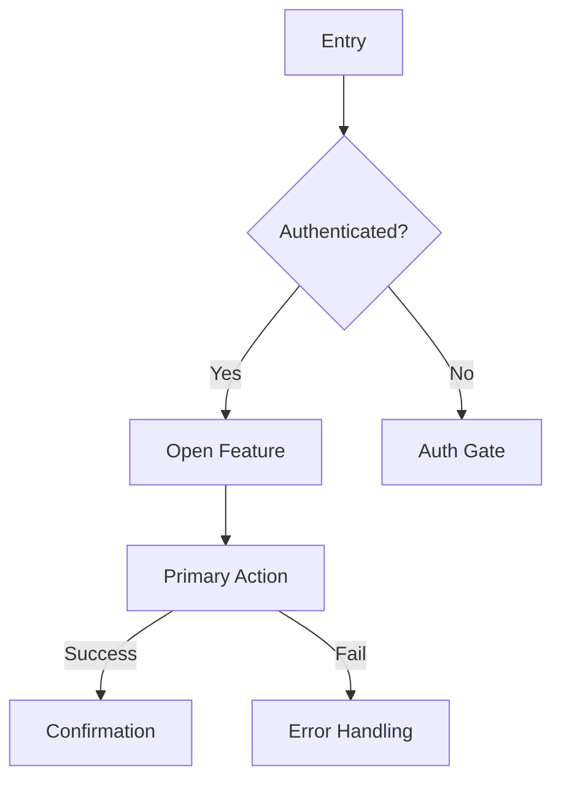

# Designer → Developer Handoff Template

> Duplicate this file per project. Keep it up‑to‑date and link to source of truth (Figma, Jira, Git, etc.). Use the **Per‑Feature Spec** section for each feature.

---

## 0) Project Overview
- **Project name:**
- **One‑liner / Job‑to‑be‑Done:**
- **Problem & goals:**
- **Success metrics (North Star + leading indicators):**
- **Scope (in / out):**
- **Key links:** Figma │ Jira/Epic │ Repo/Branch │ Design tokens │ Copy deck │ Analytics plan │ QA sheet

### Team & Contacts
| Role | Name | Handle | Responsibilities |
|---|---|---|---|
| Product |  |  |  |
| Design |  |  |  |
| Eng Lead |  |  |  |
| Frontend |  |  |  |
| Backend |  |  |  |
| QA |  |  |  |
| Legal/Privacy |  |  |  |

### Timelines
- **Milestones:** Alpha ▶ Beta ▶ Launch
- **Code freeze:**
- **Design freeze:**
- **Experiment/flag windows:**

---

## 1) Global Requirements & Constraints
- **Supported platforms/browsers/devices:** (min OS, browsers, responsive breakpoints)
- **Performance budgets:** (TTI, LCP, CLS, FPS targets)
- **Accessibility (a11y):** (WCAG level, keyboard map, screen‑reader order, focus states)
- **Internationalization (i18n):** locales, RTL handling, pluralization rules
- **Security & privacy:** (PII, data retention, encryption at rest/in transit, auth scopes)
- **Compliance:** (e.g., GDPR, CCPA, SOC2, HIPAA—if applicable)
- **Theming & tokens:** color, spacing, typography, motion tokens (link to source)
- **Analytics/telemetry:** events, props, IDs, success definitions
- **Feature flags / rollout plan:** flag key, target cohorts, kill‑switch behavior
- **Dependencies:** libraries, services, other features; migration/upgrade notes

---

## 2) Asset & Source of Truth Index
- **Figma file:** (page, frame IDs)
- **Prototype(s):** (paths, expected behaviors)
- **Design tokens:** (JSON URL / figma‑tokens ref)
- **Iconography & images:** export specs (format, @1x/@2x/@3x, compression)
- **Copy deck:** (sheet or CMS path)
- **API & schema:** (OpenAPI URL or doc)

---

# 3) Per‑Feature Spec (Duplicate this section per feature)

## 3.1 Feature Summary
- **Feature name:**
- **User story:** “As a <role>, I want <capability> so that <benefit>.”
- **Acceptance criteria (BDD/Gherkin):**
```gherkin
Given <context>
When <action>
Then <outcome>
```
- **Non‑goals:**

## 3.2 Tasklist Checklist
Use this as a DoD (Definition of Done). Convert to tickets as needed.
- [ ] Routes created & behind feature flag (name: `feat.<feature_key>`)
- [ ] Data contract agreed (request/response, errors)
- [ ] UI states implemented (default, hover, focus, active, disabled)
- [ ] Loading & skeleton states
- [ ] Empty state content
- [ ] Error states (inline + global)
- [ ] Accessibility pass (keyboard, SR text, color contrast)
- [ ] Responsive layouts (xs, sm, md, lg, xl)
- [ ] Performance budget met
- [ ] Analytics events emitted & verified
- [ ] Copy integrated from copy deck
- [ ] QA test cases passed
- [ ] Localization hooks added & strings externalized
- [ ] Security review (if needed)
- [ ] Docs updated (README/Storybook)

## 3.3 User Flow Diagram
> Use Mermaid or attach an image. Ensure it matches Figma.


## 3.4 Screen Map & Navigation
| Screen / Route | Entry Conditions | Exit / Next | Notes |
|---|---|---|---|
|  |  |  |  |

## 3.5 UI Components & Structure (Anatomy)
For each component, define anatomy, states, props, and tokens.

### Component: <Name>
- **Purpose:**
- **Placement:** (screen/section)
- **Anatomy:**
  - Container
  - Header / Title
  - Body / Content
  - Footer / Actions
- **States:** default, hover, focus, active, disabled, loading, error, success
- **Interactions:** click, keyboard, long‑press, drag‑drop, gestures
- **Props / API:**
| Prop | Type | Required | Default | Description |
|---|---|---|---|---|
|  |  |  |  |  |
- **Design tokens:** color.*, space.*, radii.*, shadows.*, motion.*
- **Validation rules (if input):** regex, min/max, mask, debounce
- **Storybook / Example usage:** (link)

> Add as many components as needed. Repeat the table above per component.

## 3.6 Data Model & Contract
### Frontend State Shape
```ts
interface FeatureState {
  isOpen: boolean;
  status: 'idle' | 'loading' | 'success' | 'error';
  items: Item[];
  errorCode?: string;
}
```

### API Spec (excerpt)
```yaml
# OpenAPI/Swagger snippet
paths:
  /v1/feature:
    get:
      operationId: listFeatureItems
      parameters:
        - in: query
          name: cursor
          schema: { type: string }
      responses:
        '200': { description: OK }
        '4XX': { $ref: '#/components/responses/ClientError' }
        '5XX': { $ref: '#/components/responses/ServerError' }
```

### Error Taxonomy
| Code | User Message | Dev Message | Retry? | Surface |
|---|---|---|---|---|
| FE_VALIDATION | Please check the highlighted fields. | Client‑side validation failed. | No | Inline |
| API_429 | Too many requests. Try again later. | Rate limited. | Yes (with backoff) | Toast + inline |

## 3.7 Edge Cases & Error Handling
- **Network:** offline, slow 3G, request timeout
- **Auth:** expired session, insufficient scope
- **Data:** empty list, single item, max items, illegal characters, duplicates
- **Concurrency:** double‑submit, race conditions, optimistic update failures
- **Permissions:** role‑based visibility/editing rules
- **Resilience:** retries, idempotency keys, circuit breakers (if backend applies)

## 3.8 Content & Copy ("Copies")
> Keep a single source of truth. Include IDs/keys to map strings.

| Copy ID | Location | Text (en-US) | Notes | Character Limit |
|---|---|---|---|---|
| FEAT_TITLE | Header |  |  |  |
| CTA_PRIMARY | Button |  |  |  |
| EMPTY_STATE | Body |  |  |  |
| ERROR_GENERIC | Inline |  |  |  |

- **Tone & style:** brief, action‑oriented; avoid jargon
- **Localization notes:** placeholders, pluralization, gender/locale specifics

## 3.9 Visual References (Screenshots)
> Paste or link final screenshots from Figma (include @1x/@2x sizes).
- **Desktop:**
- **Tablet:**
- **Mobile:**
- **Zoom/High‑contrast variants:**

## 3.10 Interaction Details
- **Keyboard map:** Tab order, shortcuts, Escape behavior
- **Focus management:** initial focus, trapped focus in modals, return focus
- **Motion:** transition durations (ms), easing, reduced‑motion fallback
- **Haptics/Audio (if any):** cues and when to trigger

## 3.11 Analytics & Logging
| Event Name | When Fired | Properties | Success Metric |
|---|---|---|---|
| feature_view | route enter | feature_id, from | session count |
| feature_submit | primary action | result, latency_ms | conversion |

- **Privacy review:** event payloads contain no PII unless consented.

## 3.12 QA & Test Plan
- **Unit tests:** coverage targets
- **Integration/e2e cases:** list critical paths
- **Manual checklist:** happy path, edge cases, a11y tab walk, RTL
- **Known issues & mitigations:**

## 3.13 Rollout & Monitoring
- **Flag name & defaults:**
- **Cohorts & % rollout:**
- **Fallback/kill switch behavior:**
- **Dashboards to watch:** (Perf, Errors, Analytics)
- **On‑call / ownership:** who to page

## 3.14 Post‑Launch
- **Success check (T+1d/T+7d/T+30d):**
- **User feedback plan:** intercepts, surveys, CS tickets
- **Iteration backlog:**

---

# 4) Reference Checklists

## A11y Checklist (quick)
- [ ] All interactive controls reachable via keyboard
- [ ] Focus visible and not clipped
- [ ] ARIA roles/labels present where needed
- [ ] Color contrast ≥ 4.5:1 for text, 3:1 for large text/icons
- [ ] Non‑text alternatives for images/icons
- [ ] Motion respects Reduced Motion preference

## Performance Checklist
- [ ] Avoid layout thrash; use CSS transforms for animation
- [ ] Images sized correctly; lazy‑load below the fold
- [ ] Min JS/CSS; code‑split & prefetch critical routes
- [ ] Cache/API pagination

## Security & Privacy Checklist
- [ ] AuthZ checks on all sensitive actions
- [ ] No secrets in client; use env/secret manager
- [ ] Sanitize user input; escape HTML; prevent XSS/CSRF
- [ ] Data minimization; retention policy linked

---

# 5) Open Questions & Decisions Log
| Date | Decision | Context | Owner |
|---|---|---|---|
|  |  |  |  |

---

# 6) Glossary
- **AC:** Acceptance Criteria
- **DoD:** Definition of Done
- **PII:** Personally Identifiable Information
- **SR:** Screen Reader

---

## Appendix
- **Browser support matrix**
- **Breakpoints**
- **Token scale samples** (typography/spacing)
- **Color usage & states** (primary/hover/active/disabled)
- **Error message catalog** with mappings to error codes
- **Mermaid examples** (flow/sequence/state diagrams)

> Tip: Keep this document versioned alongside code. Update on every design change. 

