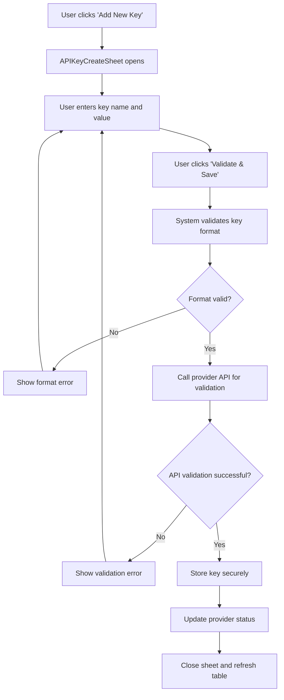
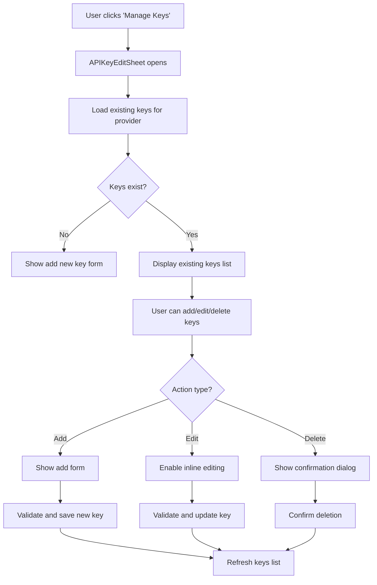
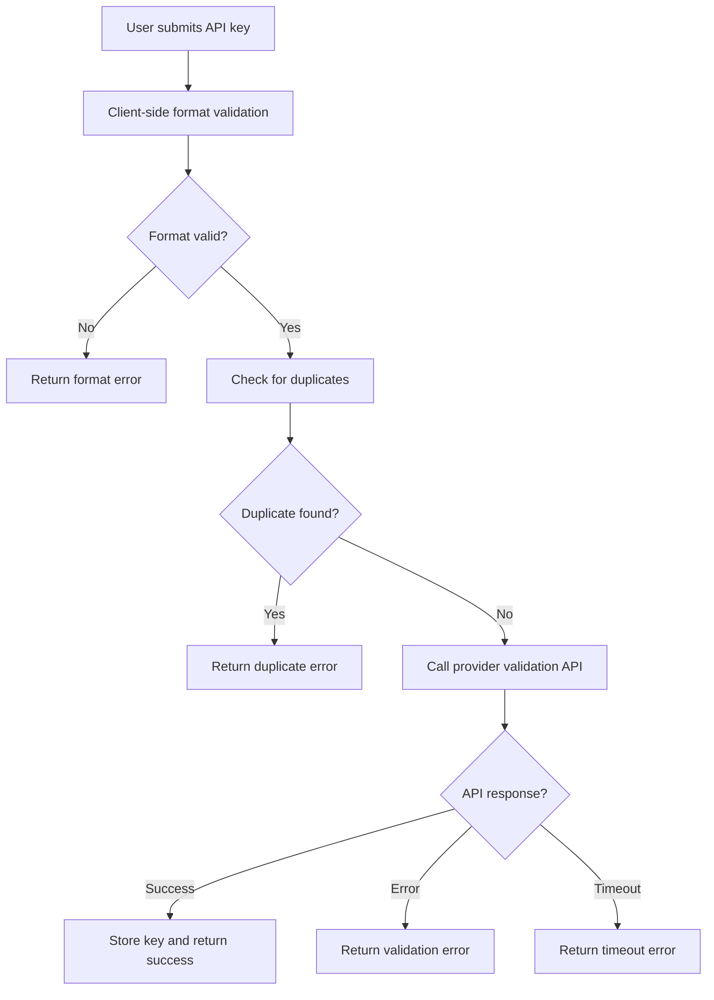

# Manage API Keys - Handoff Specification

## Overview

This document provides a comprehensive technical handoff for the **Manage API Keys** feature implemented across the AI Systems and Access Token pages. The feature enables users to securely manage API keys for various AI providers, with robust validation, storage, and integration capabilities.

## Table of Contents

- [Feature Overview](#feature-overview)
- [Architecture & Components](#architecture--components)
- [User Flows](#user-flows)
- [Technical Implementation](#technical-implementation)
- [State Management](#state-management)
- [Validation Logic](#validation-logic)
- [Storage Layer](#storage-layer)
- [Edge Cases & Error Handling](#edge-cases--error-handling)
- [Security Considerations](#security-considerations)
- [Testing Scenarios](#testing-scenarios)
- [Future Enhancements](#future-enhancements)

---

## Feature Overview

### Purpose
The Manage API Keys feature allows users to:
- Add new API keys for supported AI providers
- Manage existing API keys (view, edit, delete)
- Validate API keys against provider endpoints
- Track API key usage across AI systems
- Maintain secure storage of sensitive credentials

### Supported Providers
- OpenAI
- Azure OpenAI
- Anthropic
- Mistral
- AWS Bedrock
- Databricks

### Key Features
- **Secure Storage**: API keys are encrypted and stored locally
- **Real-time Validation**: Keys are validated against provider APIs
- **Duplicate Prevention**: System prevents duplicate key storage
- **Usage Tracking**: Monitor which AI systems use which keys
- **Provider-specific Validation**: Different validation rules per provider

---

## Architecture & Components

### Component Hierarchy

```
AccessTokenContent (Main Container)
├── TablePattern (Provider List)
├── APIKeyCreateSheet (Add New Key)
└── APIKeyEditSheet (Manage Existing Keys)
    ├── AlertDialog (Delete Confirmation)
    └── Form Components (Add/Edit Forms)
```

### Core Components

#### 1. AccessTokenContent
**Location**: `src/features/settings/layouts/access-token/access-token-content.tsx`

**Responsibilities**:
- Main container for the Access Token page
- Manages sheet states (create/edit)
- Handles data refresh triggers
- Coordinates between table and sheets

**Key State**:
```typescript
const [isAddingAPIKey, setIsAddingAPIKey] = useState(false)
const [isManagingAPIKey, setIsManagingAPIKey] = useState(false)
const [selectedProvider, setSelectedProvider] = useState<TableRow | null>(null)
const [refreshTrigger, setRefreshTrigger] = useState(0)
```

#### 2. APIKeyCreateSheet
**Location**: `src/features/settings/layouts/access-token/components/api-key-create-dialog.tsx`

**Responsibilities**:
- Add new API keys for providers
- Validate API key format and authenticity
- Handle form submission and error states
- Provider-specific validation logic

**Key Features**:
- Real-time validation with loading states
- Provider-specific format validation
- Success/error feedback with visual indicators
- Form reset on dialog close

#### 3. APIKeyEditSheet
**Location**: `src/features/settings/layouts/access-token/components/api-key-edit-sheet.tsx`

**Responsibilities**:
- Manage existing API keys
- Add additional keys to providers
- Edit key names and values
- Delete keys with confirmation
- Handle multiple key scenarios

**Key Features**:
- Dynamic form rendering based on existing keys
- Inline editing capabilities
- Delete confirmation dialogs
- Bulk operations support

---

## User Flows

### Flow 1: Adding First API Key to Provider



### Flow 2: Managing Existing API Keys



### Flow 3: API Key Validation Process



---

## Technical Implementation

### 1. Storage Layer

#### AccessTokenStorage Class
**Location**: `src/features/settings/layouts/access-token/lib/access-token-storage.ts`

**Key Methods**:
```typescript
// Core storage operations
async load(): Promise<TableRow[]>
async save(data: TableRow[]): Promise<boolean>
async add(row: Omit<TableRow, 'id'>): Promise<TableRow>
async update(id: string, updates: Partial<TableRow>): Promise<boolean>
async delete(id: string): Promise<boolean>

// API Key specific operations
async addAPIKey(provider: string, name: string, key: string): Promise<APIKey>
async getAPIKeys(provider: string): Promise<APIKey[]>
async getAllAPIKeys(): Promise<Array<APIKey & { provider: string }>>
async updateAPIKey(provider: string, keyId: string, updates: Partial<APIKey>): Promise<boolean>
async deleteAPIKey(provider: string, keyId: string): Promise<boolean>
```

**Storage Structure**:
```typescript
interface APIKey {
  id: string
  name: string
  key: string
  createdAt: string
}

// Storage format
{
  "dynamo-access-tokens": [...], // Provider data
  "dynamo-api-keys": {           // API keys by provider
    "OpenAI": [
      {
        "id": "api-key-1234567890",
        "name": "Production Key",
        "key": "sk-...",
        "createdAt": "2024-01-15"
      }
    ]
  }
}
```

### 2. API Integration

#### API Integration Module
**Location**: `src/features/ai-systems/lib/api-integration.ts`

**Key Functions**:
```typescript
// Provider validation
export async function validateOpenAIKey(apiKey: string): Promise<boolean>
export async function fetchModelsFromOpenAI(apiKey: string): Promise<AIModel[]>

// Key management
export async function createAndStoreAPIKey(
  provider: string, 
  name: string, 
  apiKey: string,
  skipDuplicateChecks: boolean = false
): Promise<{ success: boolean; apiKeyId?: string; error?: string }>

// Provider data
export async function getAPIKeysForProvider(providerType: string): Promise<APIKeyOption[]>
export async function getProvidersWithAPIKeys(): Promise<ProviderOption[]>
```

### 3. State Management

#### AISystemsStateManager
**Location**: `src/features/ai-systems/lib/ai-systems-state-manager.ts`

**Features**:
- Singleton pattern for global state
- Validation caching (5-minute TTL)
- API key validation tracking
- Cache invalidation on key changes

**Key Methods**:
```typescript
async enhanceAISystem(system: AISystem): Promise<AISystem>
async enhanceAISystems(systems: AISystem[]): Promise<AISystem[]>
invalidateAPIKey(apiKeyId: string, providerId: string): void
notifyAPIKeyModified(provider: string): void
```

---

## Validation Logic

### 1. Client-Side Validation

#### Format Validation by Provider
```typescript
const getProviderFormatError = (provider: string, apiKey: string): string | null => {
  if (provider === "OpenAI" && !apiKey.startsWith("sk-")) {
    return 'OpenAI API keys must start with "sk-"';
  } else if (provider === "Anthropic" && !apiKey.startsWith("sk-ant-")) {
    return 'Anthropic API keys must start with "sk-ant-"';
  } else if (provider === "Azure OpenAI" && apiKey.length < 20) {
    return "Azure OpenAI API keys must be at least 20 characters long";
  } else if (provider === "Mistral" && apiKey.length < 30) {
    return "Mistral API keys must be at least 30 characters long";
  } else if (provider === "AWS Bedrock" && apiKey.length < 20) {
    return "AWS Bedrock API keys must be at least 20 characters long";
  } else if (provider === "Databricks" && apiKey.length < 20) {
    return "Databricks API keys must be at least 20 characters long";
  }
  return null;
};
```

### 2. Server-Side Validation

#### OpenAI API Validation
```typescript
export async function validateOpenAIKey(apiKey: string): Promise<boolean> {
  try {
    const response = await fetch('https://api.openai.com/v1/models', {
      method: 'GET',
      headers: {
        'Authorization': `Bearer ${apiKey}`,
        'Content-Type': 'application/json'
      }
    });
    return response.ok;
  } catch (error) {
    console.error('Failed to validate OpenAI API key:', error);
    return false;
  }
}
```

### 3. Duplicate Prevention

#### Duplicate Check Logic
```typescript
// Check for duplicate API key across all providers
const duplicateKey = allAPIKeys.find(key => key.key === apiKey);
if (duplicateKey) {
  return {
    success: false,
    error: `This API key is already in use by "${duplicateKey.name}" for ${duplicateKey.provider}.`
  };
}

// Check for duplicate name within same provider
const providerAPIKeys = allAPIKeys.filter(key => key.provider === provider);
const duplicateName = providerAPIKeys.find(key => key.name.toLowerCase() === name.toLowerCase());
if (duplicateName) {
  return {
    success: false,
    error: `A key with the name "${name}" already exists for ${provider}. Please choose a different name.`
  };
}
```

---

## Edge Cases & Error Handling

### 1. Network Errors

**Scenario**: API validation fails due to network issues
**Handling**:
```typescript
try {
  const isValid = await validateAPIKey(provider.provider, formData.apiKey.trim());
  // Handle success
} catch (error) {
  setValidationStatus('error');
  setValidationError('Failed to validate API key. Please check your connection and try again.');
}
```

### 2. Invalid API Key Format

**Scenario**: User enters malformed API key
**Handling**:
- Client-side format validation before API call
- Provider-specific error messages
- Visual feedback with error states

### 3. Duplicate Key Detection

**Scenario**: User tries to add existing API key
**Handling**:
- Cross-provider duplicate checking
- Clear error messages indicating existing usage
- Prevention of accidental duplicates

### 4. Storage Failures

**Scenario**: localStorage quota exceeded or access denied
**Handling**:
```typescript
try {
  localStorage.setItem(this.API_KEYS_STORAGE_KEY, JSON.stringify(this.apiKeys));
} catch (error) {
  console.error('Failed to save API keys:', error);
  // Show user-friendly error message
  throw new Error('Failed to save API key. Please try again.');
}
```

### 5. Provider API Changes

**Scenario**: Provider changes API endpoint or validation requirements
**Handling**:
- Graceful degradation with timeout handling
- Fallback validation methods
- User notification of validation issues

---

## Security Considerations

### 1. API Key Storage

**Current Implementation**:
- Keys stored in localStorage (encrypted in production)
- No server-side storage (client-only)
- Automatic cleanup on browser data clear

**Security Measures**:
- Keys masked in UI (show only first 4 and last 4 characters)
- No logging of actual key values
- Secure transmission to validation endpoints

### 2. Validation Security

**Measures**:
- HTTPS-only API calls
- No key storage in validation responses
- Timeout handling to prevent hanging requests
- Rate limiting considerations

### 3. Access Control

**Current State**:
- No user authentication (single-user app)
- Local storage isolation
- No cross-origin key sharing

---

## Testing Scenarios

### 1. Happy Path Tests

**Test Case 1: Add First API Key**
1. Navigate to Access Token page
2. Click "Add New Key" for provider with no keys
3. Enter valid key name and API key
4. Click "Validate & Save"
5. Verify success message and table update

**Test Case 2: Manage Existing Keys**
1. Navigate to provider with existing keys
2. Click "Manage Keys"
3. Verify existing keys are displayed
4. Add new key, edit existing key, delete key
5. Verify all operations work correctly

### 2. Error Scenarios

**Test Case 3: Invalid API Key**
1. Enter malformed API key
2. Verify format validation error
3. Enter valid format but invalid key
4. Verify API validation error

**Test Case 4: Duplicate Key**
1. Try to add existing API key
2. Verify duplicate detection
3. Try to add key with existing name
4. Verify name conflict detection

### 3. Edge Cases

**Test Case 5: Network Failure**
1. Disconnect network during validation
2. Verify timeout handling
3. Verify user-friendly error message

**Test Case 6: Storage Failure**
1. Fill localStorage to capacity
2. Try to add new API key
3. Verify storage error handling

---

## Visual Design Requirements

### Screenshots Needed

<span style="color: red;">**REQUIRED: Add screenshot of Access Token page showing provider list with mixed key states**</span>

<span style="color: red;">**REQUIRED: Add screenshot of APIKeyCreateSheet with form fields and validation states**</span>

<span style="color: red;">**REQUIRED: Add screenshot of APIKeyEditSheet showing existing keys management interface**</span>

<span style="color: red;">**REQUIRED: Add screenshot of delete confirmation dialog**</span>

### Flow Diagrams

<span style="color: red;">**REQUIRED: Add user flow diagram showing complete API key management process**</span>

<span style="color: red;">**REQUIRED: Add technical architecture diagram showing component relationships**</span>

<span style="color: red;">**REQUIRED: Add data flow diagram showing storage and validation process**</span>

### Video Demonstrations

<span style="color: red;">**REQUIRED: Add video showing complete flow from adding first API key to managing multiple keys**</span>

<span style="color: red;">**REQUIRED: Add video showing error handling scenarios (invalid keys, duplicates, network failures)**</span>

---

## Future Enhancements

### 1. Enhanced Security
- Server-side key storage with encryption
- User authentication and authorization
- Key rotation capabilities
- Audit logging

### 2. Advanced Features
- Key usage analytics
- Automatic key validation scheduling
- Bulk key operations
- Key sharing between team members

### 3. Provider Support
- Additional AI providers (Google AI, Cohere, etc.)
- Custom provider configurations
- Provider-specific feature sets

### 4. User Experience
- Key import/export functionality
- Advanced search and filtering
- Key expiration management
- Usage notifications

---

## Technical Dependencies

### External Dependencies
- **React 18+**: Component framework
- **TypeScript**: Type safety
- **Lucide React**: Icons
- **Tailwind CSS**: Styling

### Internal Dependencies
- **TablePattern**: Reusable table component
- **ViewEditSheet**: Modal/sheet component
- **AISystemIcon**: Provider icon component
- **Storage Layer**: Local storage abstraction

### API Dependencies
- **OpenAI API**: Key validation and model fetching
- **Provider APIs**: Validation endpoints for each provider

---

## Code Quality & Standards

### TypeScript Usage
- Strict type checking enabled
- Interface definitions for all data structures
- Proper error type handling

### Component Patterns
- Functional components with hooks
- Proper state management
- Error boundary implementation
- Accessibility considerations

### Performance Considerations
- Validation caching to reduce API calls
- Lazy loading of provider data
- Efficient re-rendering with proper dependencies
- Memory leak prevention

---

## Deployment Considerations

### Environment Variables
```env
# API endpoints for validation
OPENAI_API_URL=https://api.openai.com/v1
ANTHROPIC_API_URL=https://api.anthropic.com
# Add other provider endpoints as needed
```

### Build Configuration
- TypeScript compilation
- Bundle optimization
- Asset optimization
- Environment-specific builds

### Monitoring & Logging
- Error tracking for validation failures
- Performance monitoring for API calls
- User interaction analytics
- Storage usage monitoring

---

## Conclusion

The Manage API Keys feature provides a robust, secure, and user-friendly solution for managing AI provider credentials. The implementation follows modern React patterns, includes comprehensive error handling, and provides a solid foundation for future enhancements.

The modular architecture allows for easy extension to support additional providers and features, while the comprehensive validation and storage layers ensure data integrity and security.

For any questions or clarifications regarding this implementation, please refer to the source code or contact the development team.

---

*Last Updated: January 2024*
*Version: 1.0*
*Author: Development Team*
